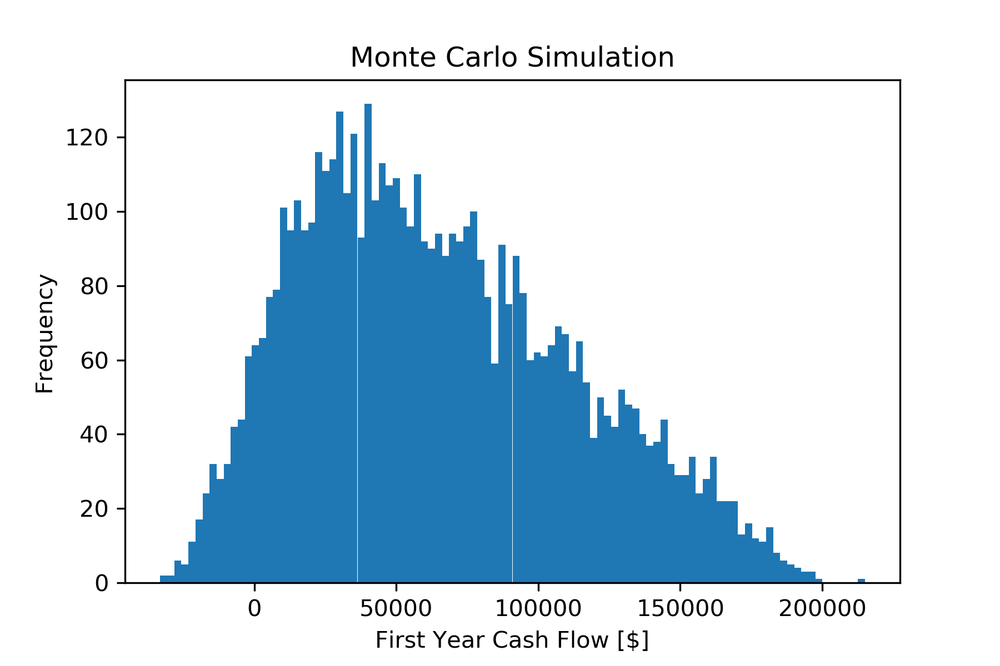

# Monte Carlo Cash Flow Simulation 🧮
## A crude implementation in Python using TFP libraries

Monte Carlo simulations are used to model the probability of different outcomes in a process that cannot easily be predicted due to the intervention of random variables. It is a technique used to understand the impact of risk and uncertainty in prediction and forecasting models. [Investopedia](https://www.investopedia.com/terms/m/montecarlosimulation.asp) These random variables can be defined in terms of whether they have discrete or continuous values, symmetry (or asymmetry), upper and lower bounds, likelihood of observing certain outliers, etc., through the use of probability distributions. For example, the probability of landing a 6-sided dice on 3 can be described with a Bernoilli distribution, which describes the probability of success (p = 1/6 or 0.167) and failure (1 - p, which is 5/6 or 0.833). Multiples of these trials can be represented with the Binomial distribution, which describes the probability of success over n Bernoulli trials, letting you calculate how likely you are to roll a 3 over 5 consecutive attemps (spoiler alert, chances aren't very high). The Beta distribution is another great one, it is used for describing and predicting the batting averages of [baseball players](http://varianceexplained.org/statistics/beta_distribution_and_baseball/).

The inspiration for this proof of concept initially came from my undergraduate engineering capstone. The idea was to see if I could use Monte Carlo simulations to provide some kind of useful insight on what are possible scenarios of a business model given certain constraints. Also, I noticed that I found less resources with examples of the probability distributions that come with [Tensorflow Probability](https://github.com/tensorflow/probability) being put to use in projects versus the ones that come with scipy.stats and numpy. It seemed like a nice way to contribute to the community.

The model used for the project was for a peer-to-peer food sharing startup; imagine you could sell the food you made in your own kitchen to others around you. I knew well that this could be a controvertial idea due to food safety concerns and the strict cottage laws that govern this kind of activity. However, the idea makes it easier to test the hypothesis that the less investment capital there is the smaller the probability of a positive cash flow.

The specific model that is being simulated is:
Cash Flow = Revenue - Cost - Taxes + Investment Capital [1 year]

While we could take a wild guess at what these variables (not the taxes because those depend on revenue - cost), we can define them in terms of other variables or constants that we know (and some inspiration from Enrico Fermi) to better approximate their potential values. The script has comments on the reasoning behind the choices of the different distributions. However, please feel free to experiment with other distributions. This is the beauty of the Monte Carlo simulation, you can change them to your liking to test different scenarios. What would happen if there is no investment capital? What about half of the possible number of orders? You can scrutinize the model in many ways to test all sorts of scenarios.

## Use 👨‍💻

You need to have the following packages available to use the script: tensorflow (also tested on tensorflow-rocm, should also work with tfp-nightly), tensorflow-probability (or tfp-nightly), numpy, scipy.stats, and matplotlib. Run the script on your terminal or IDE of choice and input the number of iterations you would like the script to perform when prompted. Once it finishes, it will print descriptive statistics about the results and save the matplotlib figure as a .png on the same directory as the script.

## Next iterations (See what I did there?) 🔮

As I mentioned, this prototype script was a proof of concept to see if I could replicate what I did with Excel plug-ins as an undergrad before I even knew Python. Some changes/improvements I plan to try incorporating are multithread use, better plots with more information such as the values of each revenue, cost, and investment capital shown alongside the cash flow dollar amount, and better ways to make the script more interactive so that the distributions don't have to be hardcoded for every run. Adding statistical measurements of the relationship of these three variables with the cash flow output could also be useful. Another direction this could take would be to incorporate exponential growth over the course of simulated year. 

One thing that I just could not find was the Discrete distribution within the TensorFlow Probability documentation. Maybe I missed it but it would be nice to not have to use an entire package (scipy.stats) for just one distribution.
